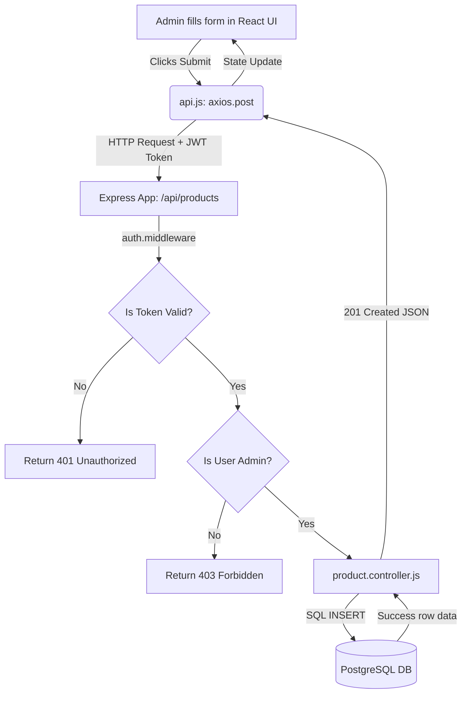

# Mokshita Enterprises - Complete Codebase Documentation

Welcome to the comprehensive, beginner-friendly guide to the Mokshita Enterprises project. This document explains how the entire system works end-to-end, covering the architecture, frontend, backend, database, and deployment.

---

## 1. Project Overview

**What this project does:**
Mokshita Enterprises is an e-commerce platform that sells Indian art, experiences, and luxury handicrafts. It allows customers to browse products, add them to a cart, and place orders. Administrators can log in to a special dashboard to manage products and fulfill orders.

**Main technologies used:**
- **Customer Frontend:** Pure HTML, CSS, and Vanilla JavaScript (No heavy frameworks for the customer facing site to keep it fast).
- **Admin Dashboard Frontend:** React.js, Vite (A modern framework for complex, interactive admin interfaces).
- **Backend API:** Node.js with Express.js (A fast server that processes requests and handles business logic).
- **Database:** PostgreSQL (A powerful relational database for storing users, products, and orders).
- **Deployment Server:** Hostinger VPS using Ubuntu, Nginx, and PM2.

**Overall architecture summary:**
1. A user visits the website and clicks "Add to Cart".
2. The frontend sends an HTTP request to the backend API (`Node.js`).
3. The backend checks if the user is authorized (using JWT tokens), processes the request, and saves the data in `PostgreSQL`.
4. The backend sends a "Success" response back to the frontend, which updates the UI.

---

## 2. Frontend Structure

The frontend is divided into two distinct parts:

### A. Customer Storefront (`mokhsita-org/` folder)
- **Folder Structure:** Contains raw `.html`, `.css`, and `.js` files. It includes pages like `index.html` (Home), `product.html`, `cart.html`, and `login.html`.
- **State Management:** Uses browser `localStorage` to keep track of a guest's shopping cart before they log in. 
- **Important Files:**
  - `main.js`: Handles visual animations, mobile menus, and scroll effects.
  - `cart.js`: Contains complex logic for adding items to the cart, syncing guest carts with user accounts upon login, and processing checkout. 

### B. Admin Dashboard (`test-dashboard-mok/` folder)
- **Folder Structure:** Built with React/Vite. The main code lives in the `src/` folder (divided into `components/`, `pages/`, `services/`).
- **Main Pages:** `AdminProductsPage.jsx` (for adding/editing products), `AdminOrdersPage.jsx` (for updating order statuses).
- **State Management:** Uses React's built-in `useState` and `useEffect` hooks.
- **API Integration:** Uses `axios` inside `src/services/api.js`. This file acts as a "bridge" — every time React needs data, it calls functions from `api.js`, which then talks to the backend.

---

## 3. Backend Structure

The backend is built with **Node.js** and **Express.js** and lives in the `mokshita-new-backend/` folder. 

**Folder Structure:**
- `server.js`: The absolute starting point. It connects to the database and starts listening for web traffic on port 3000.
- `src/app.js`: Configures the Express server. It sets up security (Helmet), CORS (allowing the frontend to talk to the backend), and defines the main API routes.
- `src/config/`: Contains `db.js` (connects to PostgreSQL) and `migrate.js` (creates database tables).
- `src/routes/`: Defines the URLs people can visit (e.g., `/api/products`).
- `src/controllers/`: Contains the actual logic. If a route says "someone wants a product," the controller is the code that goes to the database, gets the product, and returns it.
- `src/middlewares/`: "Gatekeepers" that run before controllers. E.g., checking if a user has a valid login token.

---

## 4. Authentication Flow

How do we know who is logged in securely? We use **JWT (JSON Web Tokens)**.

1. **Login Flow:** The user types their email and password. The frontend sends this to `POST /api/auth/login`.
2. **Verification:** The backend looks up the email in the database and uses `bcrypt` to verify the password matches the hashed password.
3. **Token Creation:** The backend creates a secure JWT string and sends it back to the frontend.
4. **Token Storage:** The frontend saves this token in `localStorage` (as `mok_token`).
5. **Protected Routes:** Every time the frontend wants to do something private (like view their order history), `api.js` automatically attaches this token to the HTTP header (`Authorization: Bearer <token>`).
6. **Middleware Validation:** The backend's `auth.middleware.js` checks if the token is valid before letting the request through.
7. **Admin Authentication:** `admin.middleware.js` goes one step further. It decodes the token, checks the user's role in the database, and blocks the request if the role is not `'admin'`.

---

## 5. Product Management Flow

Let's trace how an Admin manages products:

- **Fetching Products:** The Admin Dashboard loads and calls `GET /api/products`. The `product.controller.js` queries the database, sorts the results, and returns an array of products.
- **Creating a Product:** The Admin fills out a form and clicks "Save". A `POST /api/products` request is made. The backend validates the inputs (e.g., price cannot be negative). The `createProduct` controller generates a URL-friendly `slug` (e.g., "Silk Saree" -> "silk-saree") and inserts the new row into PostgreSQL.
- **Editing:** The Admin edits a product. A `PUT /api/products/:id` request is sent. The database updates using the `COALESCE` SQL command (meaning "only update fields that were actually changed").
- **Deleting:** A `DELETE /api/products/:id` request removes the item from the database.

---

## 6. API Documentation

| Endpoint | Method | Auth Required | Description | Request Body Example |
|----------|--------|---------------|-------------|----------------------|
| `/api/auth/login` | POST | Public | Logs in a user | `{ "email": "a@b.com", "password": "123" }` |
| `/api/auth/register` | POST | Public | Creates a user | `{ "email": "a@b.com", "password": "123", "full_name": "John" }` |
| `/api/products` | GET | Public | Gets all products | None |
| `/api/products` | POST | Admin JWT | Creates product | `{ "name": "Vase", "price": 500, "stock": 10 }` |
| `/api/cart` | POST | User JWT | Adds item to cart | `{ "productId": "uuid-here", "quantity": 1 }` |
| `/api/orders/checkout`| POST | Optional | Places an order | `{ "address": "123 St", "payment_method": "COD" }` |
| `/api/admin/orders` | GET | Admin JWT | Lists all orders | None |

---

## 7. Database Structure

The database uses PostgreSQL and handles relationships using foreign keys.

- **users:** Stores customer and admin accounts. (`id`, `email`, `password_hash`, `role`).
- **products:** Stores items for sale. (`id`, `name`, `price`, `stock`, `image_url`).
- **carts & cart_items:** A user has one `cart`. A `cart` has many `cart_items` (which link to a `product`).
- **orders & order_items:** When a checkout happens, the cart is cleared, and an `order` is created. `order_items` stores a snapshot of what was bought and the price *at that specific time*.

---

## 8. Image Upload System

**How it currently works:**
Currently, there is **no direct file upload system** (like `multipart/form-data` or Multer) in the backend codebase.

**Storage Flow:**
1. The administrator uploads images to a third-party image hosting service (like Cloudinary, AWS S3, or simply copies an image address from the web).
2. The administrator pastes that direct URL into the "Image URL" field in the Admin Dashboard.
3. The database stores this as a simple text string (`image_url` column in the `products` table).
4. The frontend reads this string and puts it in an HTML `` tag.

---

## 9. Environment Variables

These are secret settings stored in a `.env` file that should never be pushed to GitHub.

| Variable | Side | What it does |
|----------|------|--------------|
| `PORT` | Backend | Which port the server runs on (e.g., 3000) |
| `DB_HOST`, `DB_PORT`, `DB_NAME`, `DB_USER`, `DB_PASSWORD` | Backend | Credentials to connect to PostgreSQL |
| `JWT_SECRET` | Backend | A long, random string used to encrypt login tokens securely |
| `JWT_EXPIRES_IN` | Backend | How long a login lasts (e.g., "7d" for 7 days) |
| `ALLOWED_ORIGINS` | Backend | Security: Limits which frontend URLs can talk to the backend |
| `VITE_API_URL` | Frontend | Tells the React dashboard where the backend is hosted |

---

## 10. Deployment Architecture

The application is deployed on a **Hostinger VPS** running Ubuntu Linux.

- **Backend Hosting:** Node.js runs the backend continuously using **PM2** (a tool that keeps Node apps alive and restarts them if they crash).
- **Reverse Proxy (Nginx):** Nginx acts as a traffic cop. When a web request hits port 80 (HTTP) or 443 (HTTPS), Nginx forwards it to the Node.js app running silently on port 3000.
- **Database Hosting:** PostgreSQL is installed directly on the same VPS, securing it from the outside world.
- **Frontend Hosting:** The React dashboard and HTML storefront can be hosted on Vercel/Netlify, or served via Nginx on the same VPS.
- **Security:** SSL certificates are generated automatically using Let's Encrypt (Certbot) to ensure the site runs on `https://`.

---

## 11. Request Flow Diagrams

Here is a simple flow of what happens when an Admin creates a new product:

---

## 12. Critical Files To Understand First

If you are new to the codebase, read these files in this exact order:

1. **`src/config/migrate.js`**: This is your map. It contains all the SQL tables. If you understand the database, you understand the app.
2. **`server.js` & `src/app.js`**: Shows you how the backend boots up and handles security and routing.
3. **`src/routes/product.routes.js`**: A perfect example of how a URL connects to a Controller.
4. **`src/controllers/product.controller.js`**: Look at `getAllProducts` to see how database queries are written.
5. **`test-dashboard-mok/src/services/api.js`**: Explains exactly how the frontend asks the backend for data.

---

## 13. Current Problems / Missing Features

- **Image Uploading:** Relying on pasting URLs is a poor experience for admins. A system using `Multer` to upload physical files to the server or Amazon S3 should be built.
- **Payment Gateway:** Currently, checkout is hardcoded to Cash on Delivery (COD). Integration with Stripe or Razorpay is missing.
- **Pagination in Customer Frontend:** While the backend supports `page` and `limit` for products, the customer frontend currently doesn't implement "Next Page" buttons.

---

## 14. Beginner Learning Roadmap For THIS Codebase

Follow these steps to safely learn the project:

**Step 1: Start the Engine**
Set up the `.env` file. Run `npm run migrate` to create the database. Run `npm run dev` to start the backend. Ensure you get the "Mokshita API is running" message.

**Step 2: Follow the Data**
Create a user using Postman or the frontend. Open pgAdmin or your terminal, log into PostgreSQL, and look at the `users` table to see how it saved.

**Step 3: Admin Powers**
Manually change your user's role to `'admin'` in the database. Log into the React dashboard and try adding a product. Watch the Network tab in your browser's Developer Tools to see the exact JSON payload being sent to the backend.

**Step 4: Trace a Checkout**
Look at the frontend `cart.js` checkout function. Trace the JSON data it sends all the way into `order.controller.js` in the backend, and watch how it creates an order and deducts stock simultaneously.

**What to avoid touching initially:**
Do not touch `cart.js` (Customer Frontend) or `app.js` (Backend Security) until you fully understand how authentication tokens and CORS work. Focus on reading `controllers` first!
